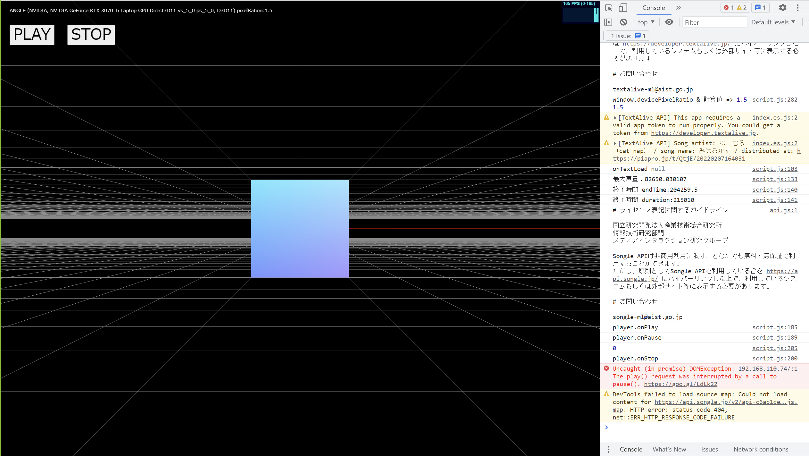

# TextAlive Templete Ver 2.0B

TextAlive APP開発用のベースプロジェクトファイル_Ver0.2B

正常に実行するにはTextAliveのトークンが必要です。
Three.jsのShaderを開発する用のテンプレート

開発者用のコンソールに、positionと歌詞が表示されるものです。



# Getting Started
Download and install Node.js on your computer (https://nodejs.org/en/download/).

Then, open VSCODE, drag the project folder to it. Open VSCODE terminal and install dependencies (you need to do this only in the first time)
```
npm install
```

Run this command in your terminal to open a local server at localhost:8080
```
npm run dev
```

# _
